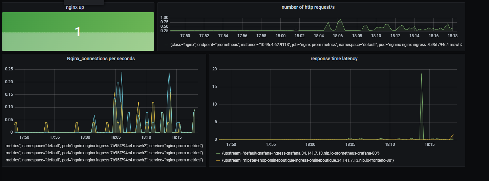
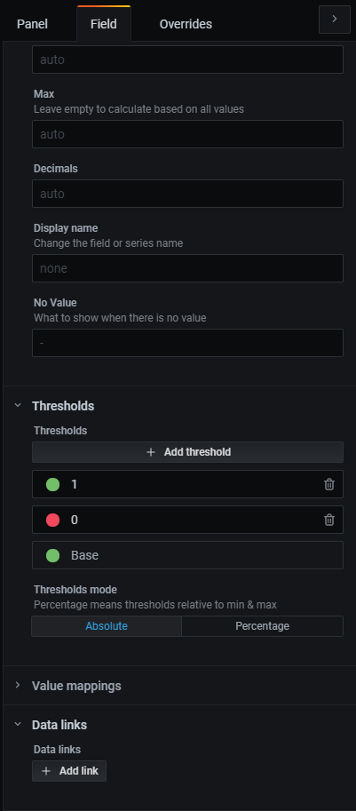

# Is it Observable?
<p align="center"></p>

##  How to observe a Ngninx ingress controller 
### Part 1 using Prometheus
<p align="center"></p>
Repository containing the files for the Episode 11 of Is it Observable : Observability of Nginx Controller using Prometheus


This repository showcase the usage of the Loki  by using GKE with :
- the HipsterShop


## Prerequisite
The following tools need to be install on your machine :
- jq
- kubectl
- git
- gcloud ( if you are using GKE)
- Helm
### 1.Create a Google Cloud Platform Project
```
PROJECT_ID="<your-project-id>"
gcloud services enable container.googleapis.com --project ${PROJECT_ID}
gcloud services enable monitoring.googleapis.com \
cloudtrace.googleapis.com \
clouddebugger.googleapis.com \
cloudprofiler.googleapis.com \
--project ${PROJECT_ID}
```
### 2.Create a GKE cluster
```
ZONE=us-central1-b
gcloud containr clusters create isitobservable \
--project=${PROJECT_ID} --zone=${ZONE} \
--machine-type=e2-standard-2 --num-nodes=4
```
### 3.Clone Github repo
```
git clone https://github.com/isItObservable/Loki-Ngninx-Logql/
cd Loki-Ngninx-Logql/

```
### 4. Install the ngninx controller
#### 1. Deploy
```
helm repo add nginx-stable https://helm.nginx.com/stable
helm install ngninx nginx-stable/nginx-ingress --set controller.enableLatencyMetrics=true --set prometheus.create=true --set controller.config.name=nginx-config
```
this command will install the nginx controller with configmap named nginx-config


##### 3. get the ip adress of the ingress gateway
```
IP=$(kubectl get svc ngninx-nginx-ingress -ojson | jq -j '.status.loadBalancer.ingress[].ip')
```
##### 4. update the deployment file
```
sed -i "s,IP_TO_REPLACE,$IP," hipstershop/k8s-manifest.yaml
sed -i "s,IP_TO_REPLACE,$IP," grafana/ingress.yaml
```
### 5. Deploy Prometheus
#### HipsterShop
```
cd hipstershop
kubectl create ns hipster-shop
kubectl -n hipster-shop create rolebinding default-view --clusterrole=view --serviceaccount=hipster-shop:default
kubectl -n hipster-shop apply -f k8s-manifest.yaml
```
#### Prometheus
```
helm install prometheus stable/prometheus-operator
```
#### Expose Grafana
```
kubectl get svc
kubectl edit svc prometheus-grafana
```
change to type NodePort
```yaml
apiVersion: v1
kind: Service
metadata:
  annotations:
    meta.helm.sh/release-name: prometheus
    meta.helm.sh/release-namespace: default
  labels:
    app.kubernetes.io/instance: prometheus
    app.kubernetes.io/managed-by: Helm
    app.kubernetes.io/name: grafana
    app.kubernetes.io/version: 7.0.3
    helm.sh/chart: grafana-5.3.0
  name: prometheus-grafana
  namespace: default
  resourceVersion: "89873265"
  selfLink: /api/v1/namespaces/default/services/prometheus-grafana
spec:
  clusterIP: IPADRESSS
  externalTrafficPolicy: Cluster
  ports:
  - name: service
    nodePort: 30806
    port: 80
    protocol: TCP
    targetPort: 3000
  selector:
    app.kubernetes.io/instance: prometheus
    app.kubernetes.io/name: grafana
  sessionAffinity: None
  type: NodePort
status:
  loadBalancer: {}
```
Deploy the ingress by making sure to replace the service name of your grafana
```
cd ..\grafana
kubectl apply -f ingress.yaml
```
Get the login user and password of Grafana
* For the password :
```
kubectl get secret --namespace default prometheus-grafana -o jsonpath="{.data.admin-password}" | base64 --decode
```
* For the login user:
```
kubectl get secret --namespace default prometheus-grafana -o jsonpath="{.data.admin-user}" | base64 --decode
```

#### Create the ServiceMonitor to scrape the nginx metrics
In order to let the Prometheus scrape the nginx metrics we need to create a ServiceMonitor
```
kubectl apply -f prometheus/servicemonitor.yaml 
```
### 5. Let's build a dashboard


#### Let's create a dahsboard reporting few metrics related to our Ingress controller
<p align="center"></p>

##### Health of the ingress

The Nginx ingress controller expose a metric returning 1 if the ingress is up and 0 if it's down.
We would utilize this indicator to report the "health" of the ingress controller.
```
nginx_ingress_nginx_up
```
We will use a "Stat" visualization and configure a threshold to change colour of the graph based on the value of the metric:
* Green will be use if the value is 1
* Red will be use if the value is 0
<p align="center"></p>

##### Number of http request/s
we will build a graph showing the number of http request/s handeled by the ingress
here is the promql for the graph:
```
  rate(nginx_ingress_nginx_http_requests_total{instance=~"$instance"}[30s])
```
##### Number of connections/s
here is the several promql for each metric: 
```
  rate(nginx_ingress_nginx_connections_accepted[30s])
  rate(nginx_ingress_nginx_connections_handled[30s])
  rate(nginx_ingress_nginx_connections_waiting[30s])
```
##### Response time in ms
here is the  promql that will show the latency for each upstream; 
```
avg(rate(nginx_ingress_controller_upstream_server_response_latency_ms_sum[30s])) by (upstream)
```